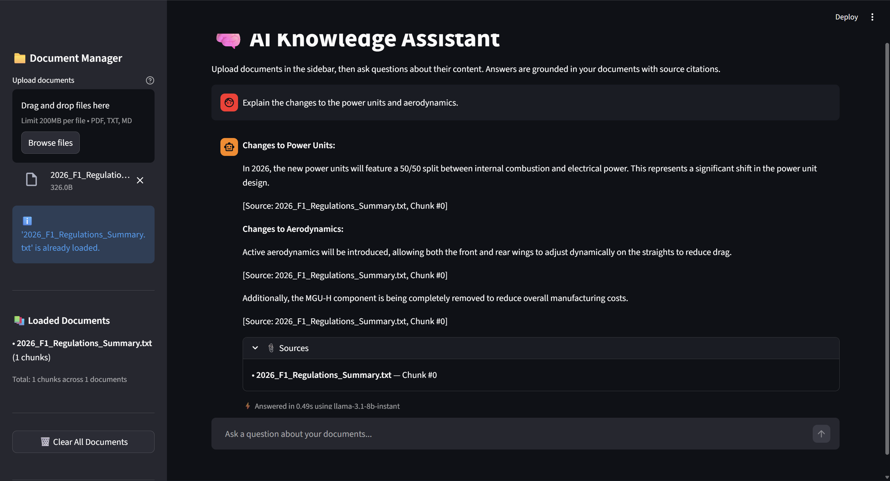
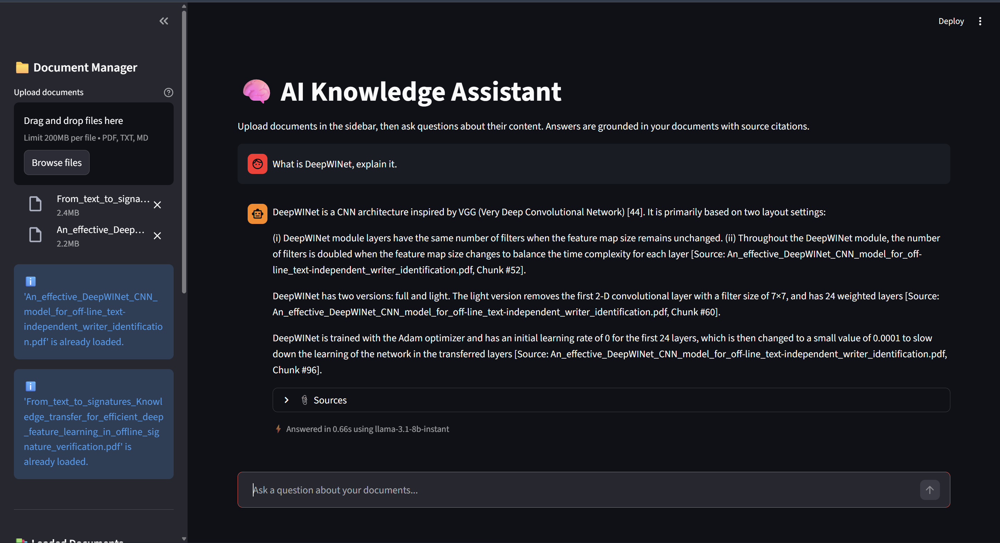
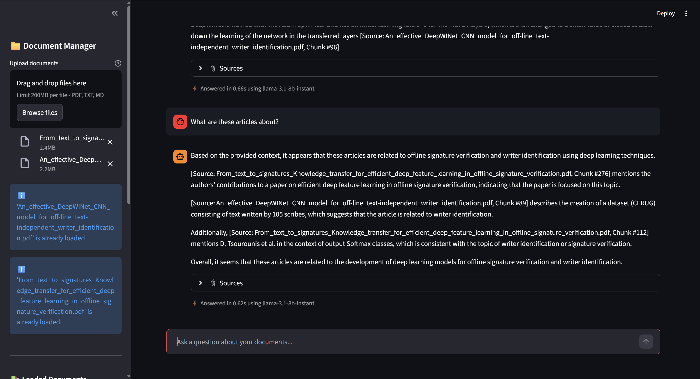
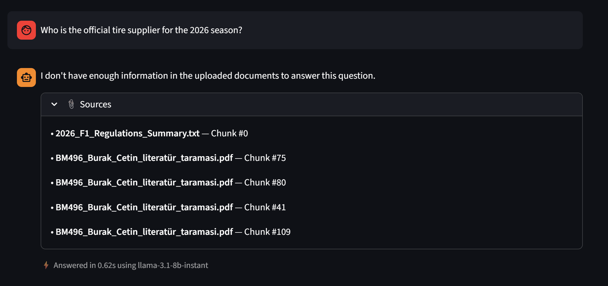
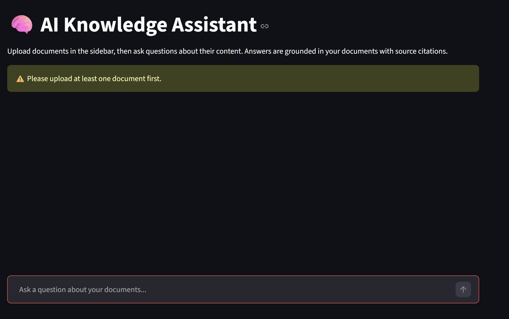

# 🧠 AI Knowledge Assistant

> A RAG-powered document Q&A system built with Streamlit, ChromaDB, and Groq LLM.

Upload PDF, TXT, or Markdown documents and ask questions — the AI will answer **only** based on your documents with source citations.

---

## ✨ Features

- **Multi-format upload**: PDF, TXT, and Markdown files
- **Intelligent chunking**: Recursive text splitting with overlap for context preservation
- **Semantic search**: Sentence-transformers embeddings + ChromaDB cosine similarity
- **Grounded answers**: LLM responses cite sources and refuse to hallucinate
- **Streaming responses**: Tokens appear in real-time for perceived speed
- **Conversation history**: Full Q&A history within a session
- **Sub-5-second inference**: Optimized end-to-end pipeline
- **Clean error handling**: Friendly messages for all edge cases

---

## � Screenshots

### Single Document Q&A


### Multi-File Upload



### Hallucination Guard — "I Don't Know"


### No Document Validation


---

## �🚀 Quick Start

### Prerequisites
- **Python 3.10+**
- **Groq API key** (free at [console.groq.com](https://console.groq.com))

### Setup

```bash
# 1. Clone the repository
git clone https://github.com/brakcetin/ai-knowledge-assistant.git
cd ai-knowledge-assistant

# 2. Create virtual environment
python -m venv venv

# 3. Activate virtual environment
# Windows:
.\venv\Scripts\activate
# macOS/Linux:
source venv/bin/activate

# 4. Install dependencies
pip install -r requirements.txt

# 5. Configure environment
cp .env.example .env
# Edit .env and add your GROQ_API_KEY
```

### Run

```bash
streamlit run app/streamlit_app.py
```

The app will open at `http://localhost:8501`.

---

## 🏗️ Architecture

```
User uploads file → File Reader → Text Chunker → Embedding Model → ChromaDB
                                                                       ↓
User asks question → Embed Query → Similarity Search → Top-K Chunks → LLM → Answer + Sources
```

### Pipeline Flow

1. **Ingestion**: File → extract text → split into ~500-char chunks → generate embeddings → store in ChromaDB
2. **Retrieval**: Question → embed → cosine similarity search → top 5 chunks
3. **Generation**: Chunks formatted as context → system prompt → Groq LLM → streamed answer with citations

---

## 🔍 How It Works

### Document Ingestion
- **PDF**: Parsed with `PyPDF2`, text extracted page-by-page
- **TXT / MD**: Read as UTF-8 text
- **Chunking**: `RecursiveCharacterTextSplitter` with 500-char chunks and 50-char overlap, splitting on paragraphs → sentences → words
- **Embeddings**: `all-MiniLM-L6-v2` from sentence-transformers (384-dimensional, runs locally on CPU)
- **Storage**: ChromaDB with persistent disk storage and cosine similarity indexing

### Retrieval System
- User query is embedded with the **same model** used for document ingestion
- ChromaDB performs cosine similarity search
- Top 5 most relevant chunks are returned with metadata (source file, chunk index, similarity score)
- Low-confidence warning displayed when average similarity < 30%

### LLM Generation
- Retrieved chunks are formatted with source labels into a structured prompt
- Groq API (`llama-3.1-8b-instant`) generates the response with `temperature=0.3` for factual accuracy
- Response is **streamed** token-by-token for perceived speed
- Source citations are extracted and displayed below the answer

### Prompt Approach
The system prompt constrains the LLM to:
1. **Only use provided context** — no external knowledge
2. **Cite sources** — every claim references `[Source: file.pdf, Chunk #N]`
3. **Admit uncertainty** — responds with "I don't have enough information" when context is insufficient
4. **Stay concise** — factual, well-structured answers

```
System: You are a helpful AI Knowledge Assistant. Answer ONLY based on the provided context...
User: Context from uploaded documents: [chunks with source labels] Question: {user_question}
```

---

## ⚡ Performance Strategy

The pipeline achieves **sub-5-second** inference through:

| Stage | Optimization | Time |
|-------|-------------|------|
| Embedding model | Loaded once, cached as singleton | ~0ms (after first load) |
| Query embedding | `all-MiniLM-L6-v2` is tiny (22M params) | ~30ms |
| Vector search | ChromaDB in-process, no network latency | ~10ms |
| Context size | Limited to top 5 chunks (~2500 chars) | — |
| LLM inference | Groq `llama-3.1-8b-instant` (fastest available) | ~1-2s |
| Streaming | Tokens appear immediately | Perceived: instant |
| **Total** | | **< 3 seconds typical** |

Key decisions:
- **Groq over OpenAI**: 5-10x faster inference on Groq's custom LPU hardware
- **Local embeddings**: No API call needed for embedding (sentence-transformers runs on CPU)
- **ChromaDB in-process**: No separate server, zero network latency
- **Small context window**: Top 5 chunks keeps prompt small, LLM responds faster
- **No re-ingestion**: Documents stored persistently, embeddings computed once

---

## 📁 Project Structure

```
attimo-intern-rag/
├── app/
│   ├── __init__.py
│   ├── streamlit_app.py          # Streamlit UI entry point
│   ├── config.py                 # Environment config & validation
│   ├── ingestion/
│   │   ├── __init__.py
│   │   ├── file_reader.py        # PDF / TXT / MD reader
│   │   ├── chunker.py            # Text splitting with overlap
│   │   └── embedder.py           # Sentence-transformers embeddings
│   ├── retrieval/
│   │   ├── __init__.py
│   │   ├── vector_store.py       # ChromaDB operations
│   │   └── retriever.py          # Semantic search interface
│   ├── llm/
│   │   ├── __init__.py
│   │   ├── prompt_builder.py     # Context-aware prompt construction
│   │   └── generator.py          # Groq API integration + streaming
│   └── utils/
│       ├── __init__.py
│       └── logger.py             # Centralized logging
├── data/
│   └── chroma_db/                # Persistent vector storage (gitignored)
├── tests/
│   └── __init__.py
├── .env.example                  # Environment template
├── .gitignore
├── requirements.txt
└── README.md
```

---

## ⚙️ Configuration

All settings are in `.env`:

| Variable | Default | Description |
|----------|---------|-------------|
| `LLM_PROVIDER` | `groq` | LLM provider (`groq` or `openai`) |
| `GROQ_API_KEY` | — | Your Groq API key (required if provider is groq) |
| `OPENAI_API_KEY` | — | Your OpenAI API key (required if provider is openai) |
| `LLM_MODEL` | `llama-3.1-8b-instant` | Model name for the chosen provider |
| `EMBEDDING_MODEL` | `all-MiniLM-L6-v2` | Sentence-transformers model for embeddings |
| `CHROMA_PERSIST_DIR` | `./data/chroma_db` | ChromaDB storage directory |
| `CHUNK_SIZE` | `500` | Maximum characters per chunk |
| `CHUNK_OVERLAP` | `50` | Overlap characters between chunks |
| `TOP_K` | `5` | Number of chunks to retrieve per query |

---

## ⚠️ Limitations & Future Improvements

### Current Limitations
- **No OCR**: Scanned PDFs (image-based) cannot be processed
- **Single collection**: All documents go into one index (no per-document filtering)
- **Fixed chunking**: Chunk size is static, not adaptive to document structure
- **No authentication**: Anyone with access to the URL can use the app
- **Session-bound history**: Chat history is lost on page refresh

### Future Improvements
- 🔄 Heading-aware chunking (split on H1/H2 for structured documents)
- 🗂️ Multi-collection support with document category filters
- 🔐 User authentication and per-user document spaces
- 📊 Analytics dashboard (query patterns, response quality metrics)
- 🌐 Cloud deployment (Streamlit Community Cloud / Docker)
- 💾 Persistent chat history (database-backed)
- 📋 Table and image extraction from PDFs
- 🔍 Hybrid search (semantic + keyword/BM25)

---

## 🛠️ Tech Stack

| Component | Technology |
|-----------|-----------|
| **UI** | Streamlit |
| **Vector DB** | ChromaDB |
| **Embeddings** | sentence-transformers (`all-MiniLM-L6-v2`) |
| **LLM** | Groq (`llama-3.1-8b-instant`) |
| **PDF parsing** | PyPDF2 |
| **Text splitting** | langchain-text-splitters |
| **Config** | python-dotenv |
